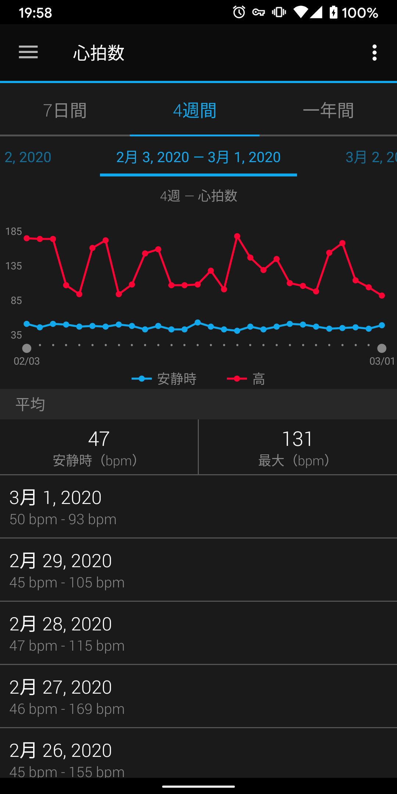
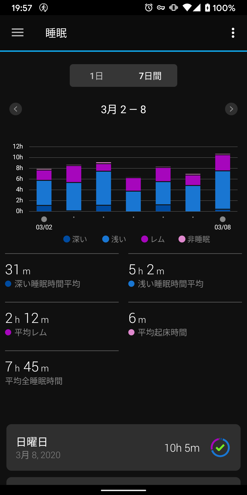
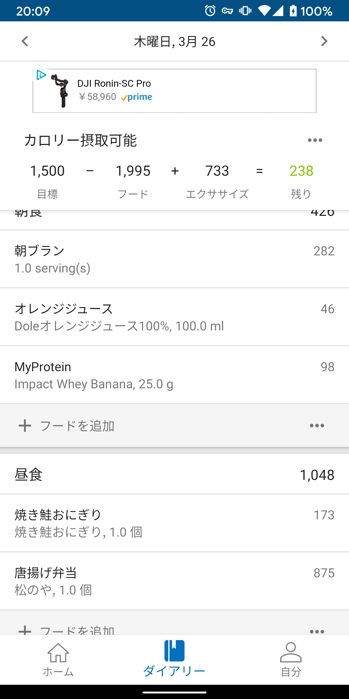
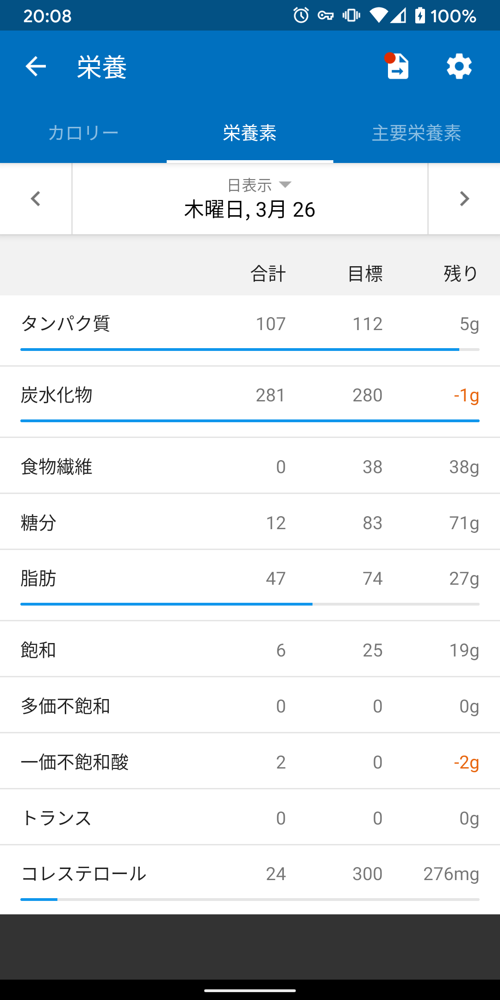
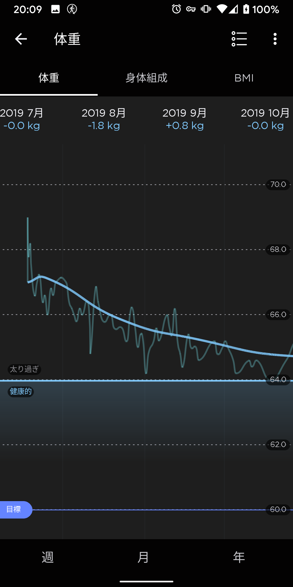
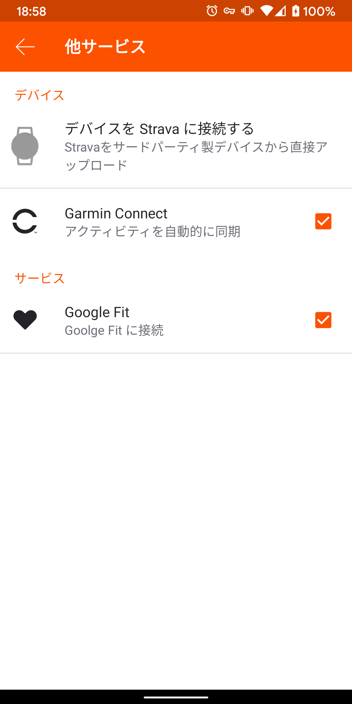
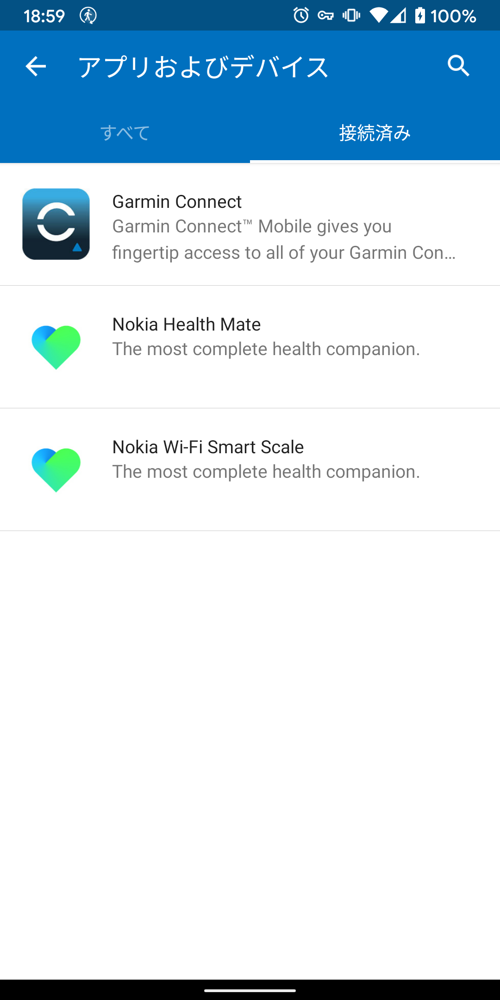
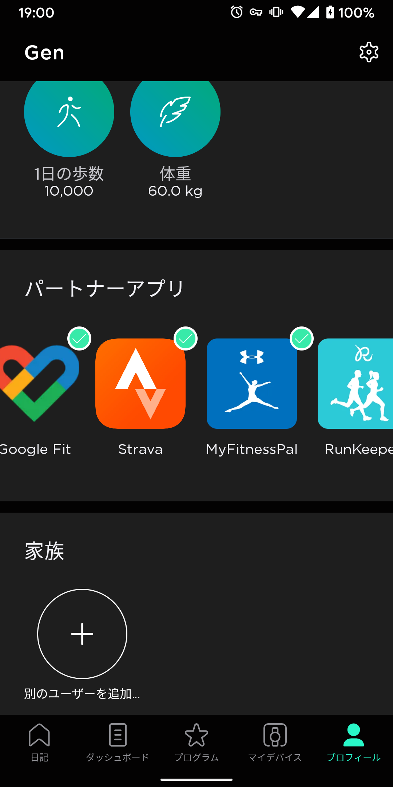
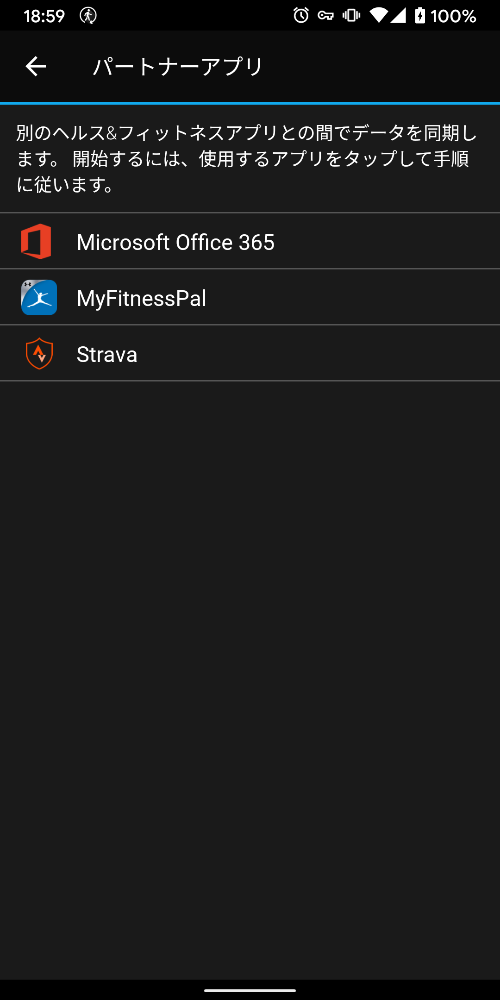
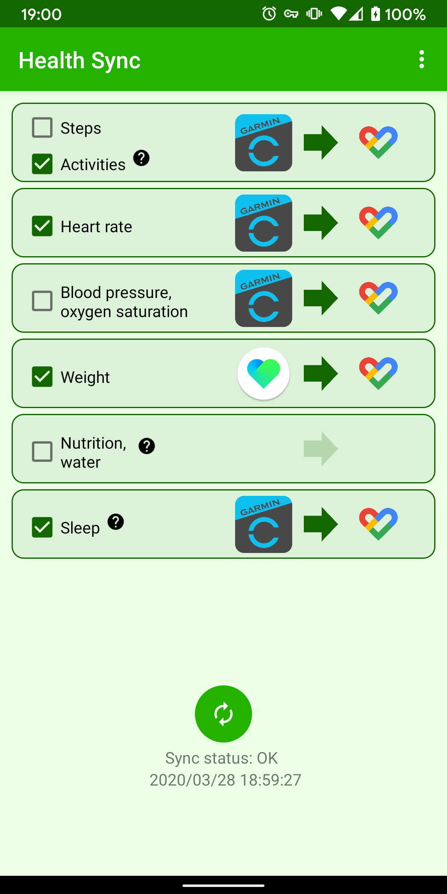

## 活用せずともデータを残そう

距離・速度・心拍・パワー…自転車に乗っていると様々なデータを取ることができます。

サイクルコンピューターを使って距離・速度を測って GPS ログをアップロードするのはもはや定番ですが、心拍やパワーに関しては「使わないから…」と思ってデータを蓄積していない人もいるのでは？

以前はこれらのデータから色々自分で計算して、必要な指標（TSS や CTL）を出したり、ベースとなる心拍数や FTP を算出したり…とかなり面倒な作業でしたが、今日ではこれらのクソ面倒な作業は全て WEB サービス側でやってくれます。

結果として、トレーニング目的ではなくとも「自分は同年代でどれほどの能力を持っているのか？」「今回のライドの回復に必要な時間はどれくらいなのか？」など、活用方法を勉強しなくてもわかりやすいフィードバックが得られるようになっています。データがあればあるほどこれらは精確になっていきます。

※ペダリングモニターのデータのようにいつまで経っても定量的に活用できないデータもありますが、まずは気にせず溜めましょう

## 基本編：まずは運動時のログを貯める

これは、好きなサイクルコンピューターかスマートウォッチを買って GPS・心拍のログを取るだけです。今から買うなら、Edge530 以上のモデルを選ぶことをおすすめします。520 以前のモデルに比べてハードソフト共にかなり進歩しています。

心拍計かパワーメーターがあると消費カロリーの数値が信憑性を帯びてきます。距離と体重・GPS ログだけだと、やや信頼性に欠けます…

インプレは[本体の過去記事](/post/2019/08/edge530j/)と、[MTB ダイナミクスインプレ](/post/2019/11/edge530_mtbd/)にて。

<LinkBox isAmazonLink url="https://www.amazon.co.jp/exec/obidos/ASIN/B07V4DG1DK/gensobunya-22/" />

## 応用編：日常生活もモニタリングしよう

もしあなたがプロのスポーツ選手で、自転車に乗っていない時間は全て休息時間なら、パワートレーニングの数値や回復日数は既に信頼性のあるものになっています。

ただし、一般的には運動時に加えて平日の疲労（いわゆる仕事の TSS）があったり、日常生活にどの程度運動が組み込まれているかどうかは無視されてしまっているため、まだ現実を反映した数値とは言い切れません。

そこで、日常の運動や心拍を測って生活の全てを数値化できるようにしていきます。活動量計・スマートウォッチが役に立ちます。サイコンを持っていても必携です。

私が使っている ForeAthelete45/45S は、薄くて軽くて日常生活で使っていても違和感が少なく非常におすすめです。持っている人は Apple Watch でもいいでしょう。

<LinkBox isAmazonLink url="https://www.amazon.co.jp/exec/obidos/ASIN/B07WG1QZHJ/gensobunya-22/" />

### 睡眠と安静時心拍とコンディション

睡眠時間と安静時心拍は、自分のコンディションを把握する上でかなり重要な数値です。経験上、これらが最もレース結果や体感的な調子の良さに関わってきます。

安静時心拍が高い（自分の場合は 50 に近づく場合）ときは慢性疲労している可能性が高いです。ベースラインとなる安静時心拍は人によって異なるので、自分なりの基準を見つけるためにも継続的に測っておく必要があり、スマートウォッチを付けた生活は欠かせません…

シクロクロスに限って言えば糖質消費が激しいので前日にドカ食いすると翌日のレースの調子がいいなんてこともありますが、それよりも心肺を含めた体調を整えるのは大前提。回復には睡眠が欠かせません。

週の平均睡眠時間が下がったら、忙しすぎを心配してもいいでしょう。

## カロリー収支をモニタリングしよう

ここまで来ると、「1 日に何 kcal 自分が消費しているか」能動的に何かを行わなくても自動的に算出されるようになります。

そうすると、次にやることは当然摂取カロリーの可視化です。UNDER ARMOUR 社が提供している[myfitnesspal](https://www.myfitnesspal.com/ja/)を使うと、食材もしくはメニューから簡単に摂取カロリーを計算できます。

<LinkBox url="https://play.google.com/store/apps/details?id=com.myfitnesspal.android" />

<LinkBox url="https://apps.apple.com/jp/app/myfitnesspal/id341232718?uo=4" />

なおかつ、目標体重を設定することで GARMIN CONNECT や STRAVA から消費カロリーをインポートできるので、一日の消費カロリーと摂取カロリーを比較して理想的なバランスになっているか毎日モニタリングすることができます。栄養組成目標も無料で設定できるので、タンパク質をベースに目標設定しています。

食事は毎日入力する必要があるので、中々面倒ですが頑張りましょう。自分はすぐ太るので危機感だけで頑張っています。

## 体重をモニタリングしよう

体重は[withings の body+](https://www.amazon.co.jp/exec/obidos/ASIN/B071ZG8JP2/gensobunya-22/)をを愛用しています。

同期が Bluetooth 経由ではなく、Wifi 経由なので一度設定すれば一々スマホとのペアリングを待たなくても体重計に乗るだけで記録がどんどんアップロードされていくので非常にお手軽です。

体重を記録するだけでなく、GARAMIN CONNECT や先ほど紹介した myfitnesspal に連携できる点がミソです。タニタなど国内メーカーはどうにもこの点が弱いので…IFTTT に対応してくれれば何でもできるんですが、どうにもイケてない…

<LinkBox isAmazonLink url="https://www.amazon.co.jp/exec/obidos/ASIN/B071ZG8JP2/gensobunya-22/" />

## WEB 連携！

これまで挙げてきたサービスは全て WEB API を使ってデータを単方向・双方向に連携することができます。これで様々な数値が自動で別サービスに同期されて圧倒的な利便性を享受できます

- withings スケールで測った体重が Strava・GarminConnect・Zwift に連携して FTP/kg を自動更新
- GarminConnect/Strava のアクティビティ消費カロリーを Myfitnesspal に連携して毎日のカロリー収支を可視化
- GoogleFit/Apple Healthcare に健康情報をストック

各アプリで、「パートナーアプリ」「アプリ連携」「連携」などをクリックすると、それらの WEB サイトに飛んでそれぞれのアカウントでログインするだけでデータ連携を設定できます。中国系のサイクルコンピューターやスマートバンド・スマートウォッチはこのあたりが充実していないのが良くない点ですね…

Google fit への連携はあまり流行っていないので、有志が作成した[Health sync](https://play.google.com/store/apps/details?id=nl.appyhapps.healthsync&hl=ja)というアプリを通しています。

Zwift はいまお休みしているので入っていませんが、Withings の Health Mate からは直接 Zwift に体重を送って体重計に乗ったら Zwift の体重を更新することもできます！

人力での入力は Myfitnesspal の食べた食品品目のみ！これをサボったとしても運動するときのデバイス ON と体重計に乗ることさえ忘れなければヘルスケア系のログを全て取ることができるようになりました。

いくらものぐさでな人間でもこれぐらいは続く…続きますよね？
